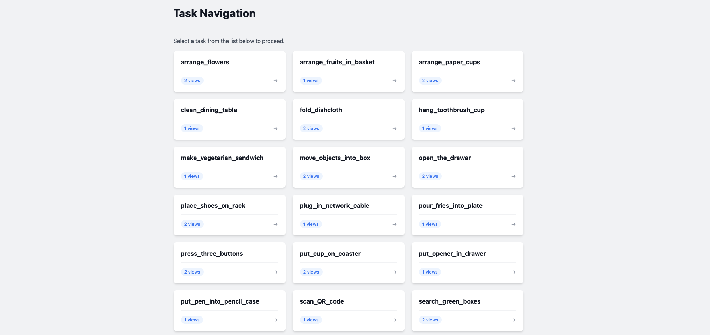
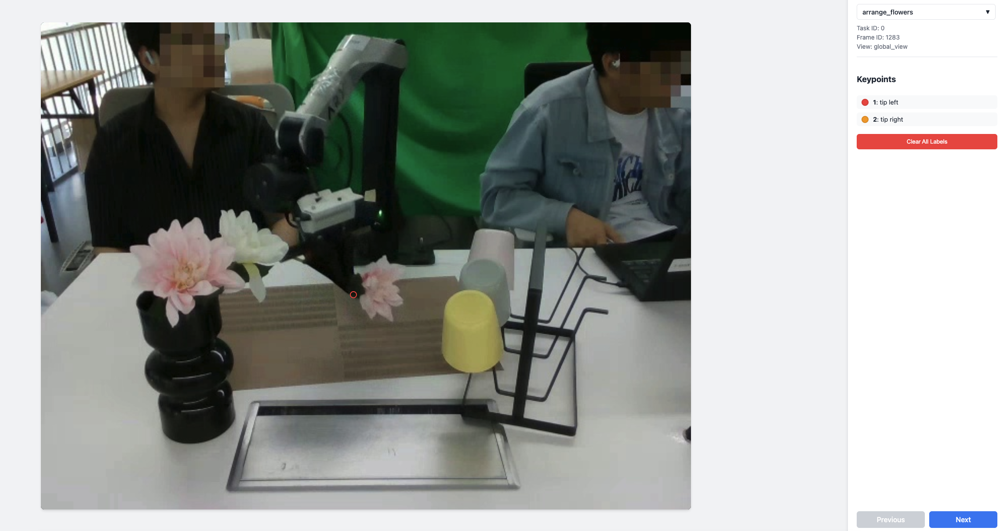

# RoboChallenge-Table30-Calibration

[English](README.md) | [中文](README_CN.md)

This project provides a comprehensive workflow for the **post-hoc calibration** of the [RoboChallenge/Table30](https://huggingface.co/datasets/RoboChallenge/Table30) dataset. It enables accurate projection from robot 3D coordinates to camera 2D image coordinates, facilitating visual feedback and data alignment for the diverse manipulation tasks in the Table30 benchmark.

## Table of Contents

- [Overview](#overview)
- [Quickstart](#quickstart)
- [Installation](#installation)
- [Supported Robots & Views](#supported-robots--views)
- [Dataset Layout](#dataset-layout)
- [Workflow](#workflow)
  - [1. Configuration](#1-configuration)
  - [2. Generate Label Tasks](#2-generate-label-tasks)
  - [3. Labeling](#3-labeling)
  - [4. Build Labeled Dataset](#4-build-labeled-dataset)
  - [5. Calibration](#5-calibration)
- [Inference](#inference)
  - [Usage](#usage)
  - [Dual-Arm Support (Aloha)](#dual-arm-support-aloha)
- [Mathematical Models & Details](#mathematical-models--details)
  - [1. Project2D (Rational Function Model)](#1-project2d-rational-function-model)
  - [2. PnP (Perspective-n-Point)](#2-pnp-perspective-n-point)
  - [3. Coordinate Transformation & Delta Application](#3-coordinate-transformation--delta-application)
- [Results](#results)
- [Troubleshooting](#troubleshooting)
- [Project Structure](#project-structure)

## Overview

The primary goal of **RoboChallenge-Table30-Calibration** is to provide accurate camera calibration parameters for the Table30 dataset. By mapping 3D points in the robot's base frame (e.g., gripper tips) to 2D pixel coordinates in camera views, this toolset supports:

- **Visual Feedback**: Overlaying robot state information on camera feeds.
- **Data Verification**: Ensuring the alignment between recorded robot states and visual observations.
- **Downstream Tasks**: Facilitating learning algorithms that require precise 2D-3D correspondence.

The codebase is specifically tailored to handle the 30 manipulation tasks and 4 robot embodiments (Aloha, ARX5, Franka, UR5) present in the RoboChallenge/Table30 dataset.

## Quickstart

1. Set `DATA_ROOT` in [config.py] to your local Table30 directory.
2. Generate labeling tasks:

```bash
python3 gen_label_tasks.py
```

3. Start the labeling UI and open `http://localhost:5312`:

```bash
python3 serve.py
```

4. Build `processed_data.pkl` for fitting:

```bash
python3 read_data.py
```

5. Fit and export calibration parameters:

```bash
python3 main.py --method project2d
python3 main.py --method pnp
```

## Installation

Ensure you have Python 3.10+ installed. Install the required dependencies:

```bash
pip install flask opencv-python numpy pyyaml scipy av tqdm
```

## Supported Robots & Views

The system supports various robot configurations and camera views, defined in `config.py`:

**Robots:**
- **Aloha**: Dual-arm robot (Left/Right arms).
- **ARX5**: Single-arm robot.
- **Franka**: Single-arm robot (Quaternion pose).
- **UR5**: Single-arm robot (Quaternion pose).

**Views:**
- **Fixed Cameras**: `global_view`, `side_view`.
- *Note*: This project currently focuses on fixed camera calibration. Support for wrist cameras (ego-centric views) can be implemented with minor modifications to the codebase.

## Dataset Layout

This repository assumes the Table30 directory layout below (based on how [config.py], [gen_label_tasks.py], and [read_data.py] traverse files):

```text
DATA_ROOT/
  <task_name>/
    meta/task_info.json                # contains robot_id (e.g., "arx5_9", "aloha_1", ...)
    data/
      episode_000000/
        meta/episode_meta.json         # contains frames count
        videos/<view_video>.mp4        # per-robot view mapping defined in config.py (VIDEO_CONFIG)
        states/*.jsonl                 # robot state logs used by read_data.py
      episode_000001/
        ...
```

If you have a different layout, update [config.py] accordingly (especially `VIDEO_CONFIG` and `get_data_dir()`).

## Workflow

### 1. Configuration

Before starting, you **must** update the `DATA_ROOT` variable in `config.py` to point to your local Table30 dataset directory.

```python
# config.py
DATA_ROOT = '/path/to/your/table30/dataset/' 
```

### 2. Generate Label Tasks

Generate labeling tasks by scanning the data directories. This selects random frames from recorded episodes for annotation.

```bash
python3 gen_label_tasks.py
```

### 3. Labeling

Start the web-based labeling server:

```bash
python3 serve.py
```

- Open `http://localhost:5312` in your browser.
- Select a task and view.
- Move your mouse to the target location and press number keys `1..N` to place keypoints (normalized to `[0, 1]` w.r.t. image width/height).
- Use `Clear All Labels` to clear current frame.
- Use `A/W/←/↑` for previous and `D/S/→/↓` for next.
- Labels are saved automatically to `results.json` in the corresponding `table30/<task>/<view>/` directory.

Keypoint count:
- Single-arm robots (ARX5/Franka/UR5): 2 points (`point0`, `point1`)
- Aloha: 4 points (`point0`..`point3`) = left arm tips + right arm tips (names configured in `config.py`)

Label files:

- `tasks.json`: a list of frames to label

```json
[
  {"path": "episode_000000", "frameid": 123},
  {"path": "episode_000001", "frameid": 45}
]
```

- `results.json`: a dict keyed by `<episode>/videos/<video>.mp4_<frameid>` with normalized keypoints

```json
{
  "episode_000000/videos/global_realsense_rgb.mp4_123": {
    "point0": [0.5123, 0.4139],
    "point1": [0.5589, 0.4128]
  }
}
```




### 4. Build Labeled Dataset

Convert `tasks.json` + `results.json` + robot state logs into per-task `processed_data.pkl` files used by the fitting code:

```bash
python3 read_data.py
```

This writes:

```text
table30/<task_name>/<view_name>/processed_data.pkl
```

### 5. Calibration

Run the calibration pipeline to fit the projection models using the labeled data.

**Using Rational Function Model (Recommended):**
```bash
python3 main.py --method project2d
```

**Using PnP Model:**
```bash
python3 main.py --method pnp
```

This process will:
1.  Load `processed_data.pkl`.
2.  Optimize model parameters (Project2D coefficients or PnP extrinsics + delta offsets).
3.  Generate validation plots and videos in `project2d/results/` or `pnp/results/`.
4.  Export parameters to `project2d/parameters.yaml` or `pnp/extrinsics.yaml`.

If `pnp/intrinsics.yaml` is missing or does not contain the current task/view, the PnP pipeline will estimate camera intrinsics (fx, fy, cx, cy) using golden-section search, save them back to `pnp/intrinsics.yaml`, then proceed with extrinsics fitting.

## Inference

The `infer.py` script demonstrates how to project 3D points to 2D image coordinates using the calibrated parameters. It automatically detects the robot type and handles single or dual-arm configurations.

### Usage

```bash
python3 infer.py --task <task_name> --view <view_name> --method <method>
```

**Arguments:**
- `--task`: Name of the task (e.g., `arrange_flowers`, `clean_dining_table`).
- `--view`: Camera view (e.g., `global_view`, `side_view`).
- `--method`: Inference method (`pnp` or `project2d`).

### Dual-Arm Support (Aloha)

For dual-arm robots like Aloha, the inference engine automatically processes both arms.

**Example Command:**
```bash
python3 infer.py --task clean_dining_table --view global_view --method project2d
```

**Output:**
```text
--- Inference Example for clean_dining_table (global_view) ---
Method: project2d
Robot: aloha

Input Robot State (2 arms):
  Arm 1: Pose=[0.3  0.2  0.2  0.   1.57 0.  ], Gripper=0.04
  Arm 2: Pose=[ 0.3  -0.2   0.2   0.    1.57  0.  ], Gripper=0.04

Processing Arm 1 (Left)...
  Input Pose: [0.3  0.2  0.2  0.   1.57 0.  ]
  Calculating 3D Endpoints...
  Tip 1 (3D): [0.50086817 0.225964   0.23377097]
  Tip 2 (3D): [0.50086817 0.174036   0.23377097]
  Projecting to 2D Image Coordinates (Project2D)...
  Tip 1 (Normalized): (0.5115, 0.4139)
  Tip 2 (Normalized): (0.5589, 0.4128)

Processing Arm 2 (Right)...
  ...
```

### Single-Arm Example (ARX5)

```bash
python3 infer.py --task arrange_flowers --view global_view --method pnp
```

**Output:**
```text
--- Inference Example for arrange_flowers (global_view) ---
Method: pnp
Robot: arx5

Input Robot State (1 arms):
  Arm 1: Pose=[0.3  0.   0.2  0.   1.57 0.  ], Gripper=0.04
...
  Tip 1 (2D pixel): (433.90, 213.02)
  Tip 2 (2D pixel): (469.42, 212.72)
```

## Mathematical Models & Details

### 1. Project2D (Rational Function Model)

This model uses a rational polynomial function to map 3D points $(x, y, z)$ to 2D normalized pixel coordinates $(u, v)$. It is a data-driven approach that implicitly handles lens distortion and perspective without explicit camera intrinsics.

**Formula:**

$$
u = \frac{p_0 x + p_1 y + p_2 z + p_6}{1 + p_3 x + p_4 y + p_5 z}
$$

$$
v = \frac{q_0 x + q_1 y + q_2 z + q_6}{1 + q_3 x + q_4 y + q_5 z}
$$

Where:
- $(x, y, z)$ is the 3D feature point in the robot base frame.
- $(u, v)$ are the normalized pixel coordinates (0 to 1).
- $p_0, \dots, p_6$ and $q_0, \dots, q_6$ are the learnable parameters.

**YAML Structure (`project2d/parameters.yaml`):**

```yaml
task_name:
  robot: robot_name
  view_name:
    regvec:
      - [p0, q0]  # Row 0
      - ...
      - [p6, q6]  # Row 6
    delta: [dx, dy, dz]
```

*   **`regvec`**: A $7 \times N$ matrix.
    *   **Single-arm**: $7 \times 2$ (Col 0: $u$ params, Col 1: $v$ params).
    *   **Dual-arm**: $7 \times 4$ (Cols 0-1: Left Arm $u,v$; Cols 2-3: Right Arm $u,v$).
*   **`delta`**: Offset parameters `[dx, dy, dz]`.

### 2. PnP (Perspective-n-Point)

This method uses the classical pinhole camera model. It estimates the 6D pose (Rotation $\mathbf{R}$, Translation $\mathbf{t}$) of the camera relative to the robot base frame.

**Formula:**

$$
s \left[\begin{array}{c} u \\ v \\ 1 \end{array}\right] = \mathbf{K} \left( \mathbf{R} \left[\begin{array}{c} x \\ y \\ z \end{array}\right] + \mathbf{t} \right)
$$

Where:
- $\mathbf{K}$ is the Camera Intrinsic Matrix (focal lengths $f_x, f_y$ and optical center $c_x, c_y$).
- $\mathbf{R}$ (Rotation Matrix) and $\mathbf{t}$ (Translation Vector) are the extrinsics.

**YAML Structure (`pnp/extrinsics.yaml`):**

```yaml
task_name:
  robot: robot_name
  view_name:
    rvec: [...] # Flattened rotation vectors
    tvec: [...] # Flattened translation vectors
    delta: [dx, dy, dz]
    resolution: [width, height]
```

### 3. Coordinate Transformation & Delta Application

Before applying either projection model, the robot's end-effector pose (usually the wrist/flange) must be converted to the specific 3D feature point (e.g., gripper tip) using `delta` offsets.

**General Formula:**

$$
\mathbf{P} = \mathbf{p}_{ee} + \mathbf{R}_{pose} \cdot \mathbf{offset}
$$

Where:
- $\mathbf{p}_{ee}$: Robot end-effector position.
- $\mathbf{R}_{pose}$: Rotation matrix from robot pose (Euler or Quaternion).
- $\mathbf{offset}$: Derived from `delta` ($dx, dy, dz$) and gripper width ($w$).

**Offset Definitions by Robot:**

#### Aloha (Dual Arm)
**Left Arm:**

$$
\begin{aligned}
\mathbf{P}_{\text{left}} &= \mathbf{p}_{ee} + \mathbf{R} \cdot \begin{bmatrix} dx \\ \frac{w}{2} + dy \\ dz \end{bmatrix} \\
\mathbf{P}_{\text{right}} &= \mathbf{p}_{ee} + \mathbf{R} \cdot \begin{bmatrix} dx \\ -\frac{w}{2} - dy \\ dz \end{bmatrix}
\end{aligned}
$$

**Right Arm:**

$$
\begin{aligned}
\mathbf{P}_{\text{left}} &= \mathbf{p}_{ee} + \mathbf{R} \cdot \begin{bmatrix} dx \\ \frac{w}{2} + dy \\ dz \end{bmatrix} \\
\mathbf{P}_{\text{right}} &= \mathbf{p}_{ee} + \mathbf{R} \cdot \begin{bmatrix} dx \\ -\frac{w}{2} - dy \\ dz \end{bmatrix}
\end{aligned}
$$

#### ARX5
$$
\begin{aligned}
\mathbf{P}_{1} &= \mathbf{p}_{ee} + \mathbf{R} \cdot \begin{bmatrix} dx \\ -\frac{w}{2} - dy \\ dz \end{bmatrix} \\
\mathbf{P}_{2} &= \mathbf{p}_{ee} + \mathbf{R} \cdot \begin{bmatrix} dx \\ \frac{w}{2} + dy \\ dz \end{bmatrix}
\end{aligned}
$$

#### Franka
$$
\begin{aligned}
\mathbf{P}_{1} &= \mathbf{p}_{ee} + \mathbf{R} \cdot \begin{bmatrix} dx \\ \frac{w}{2} + dy \\ dz \end{bmatrix} \\
\mathbf{P}_{2} &= \mathbf{p}_{ee} + \mathbf{R} \cdot \begin{bmatrix} dx \\ -\frac{w}{2} - dy \\ dz \end{bmatrix}
\end{aligned}
$$

#### UR5
*(Note the axis swap)*

$$
\begin{aligned}
\mathbf{P}_{1} &= \mathbf{p}_{ee} + \mathbf{R} \cdot \begin{bmatrix} \frac{w}{2} + dy \\ -dx \\ dz \end{bmatrix} \\
\mathbf{P}_{2} &= \mathbf{p}_{ee} + \mathbf{R} \cdot \begin{bmatrix} -\frac{w}{2} - dy \\ -dx \\ dz \end{bmatrix}
\end{aligned}
$$

## Results

The calibration method achieves high accuracy across various tasks and robot platforms. Typical normalized reprojection errors are well below 1.0%, ensuring precise alignment between the 3D robot state and the 2D camera view.

### Extrinsics Evaluation Report

| Task Name | View | Robot | Project2D Error | Project2D Plot | PnP Error | PnP Plot |
| :--- | :--- | :--- | :--- | :--- | :--- | :--- |
| arrange_flowers | global_view | arx5 | 0.011328 | [View Plot](project2d/results/arrange_flowers/global_view/project2d_fit.png) | 0.020123 | [View Plot](pnp/results/arrange_flowers/global_view/pnp_fit.png) |
| arrange_flowers | side_view | arx5 | 0.009229 | [View Plot](project2d/results/arrange_flowers/side_view/project2d_fit.png) | 0.014245 | [View Plot](pnp/results/arrange_flowers/side_view/pnp_fit.png) |
| arrange_fruits_in_basket | global_view | ur5 | 0.006856 | [View Plot](project2d/results/arrange_fruits_in_basket/global_view/project2d_fit.png) | 0.016555 | [View Plot](pnp/results/arrange_fruits_in_basket/global_view/pnp_fit.png) |
| arrange_paper_cups | global_view | arx5 | 0.007222 | [View Plot](project2d/results/arrange_paper_cups/global_view/project2d_fit.png) | 0.009693 | [View Plot](pnp/results/arrange_paper_cups/global_view/pnp_fit.png) |
| arrange_paper_cups | side_view | arx5 | 0.004157 | [View Plot](project2d/results/arrange_paper_cups/side_view/project2d_fit.png) | 0.011333 | [View Plot](pnp/results/arrange_paper_cups/side_view/pnp_fit.png) |
| clean_dining_table | global_view | aloha | 0.014808 | [View Plot](project2d/results/clean_dining_table/global_view/project2d_fit.png) | 0.011188 | [View Plot](pnp/results/clean_dining_table/global_view/pnp_fit.png) |
| fold_dishcloth | global_view | arx5 | 0.004898 | [View Plot](project2d/results/fold_dishcloth/global_view/project2d_fit.png) | 0.008899 | [View Plot](pnp/results/fold_dishcloth/global_view/pnp_fit.png) |
| fold_dishcloth | side_view | arx5 | 0.005601 | [View Plot](project2d/results/fold_dishcloth/side_view/project2d_fit.png) | 0.009432 | [View Plot](pnp/results/fold_dishcloth/side_view/pnp_fit.png) |
| hang_toothbrush_cup | global_view | ur5 | 0.006777 | [View Plot](project2d/results/hang_toothbrush_cup/global_view/project2d_fit.png) | 0.009427 | [View Plot](pnp/results/hang_toothbrush_cup/global_view/pnp_fit.png) |
| make_vegetarian_sandwich | global_view | aloha | 0.012185 | [View Plot](project2d/results/make_vegetarian_sandwich/global_view/project2d_fit.png) | 0.015294 | [View Plot](pnp/results/make_vegetarian_sandwich/global_view/pnp_fit.png) |
| move_objects_into_box | global_view | franka | 0.016472 | [View Plot](project2d/results/move_objects_into_box/global_view/project2d_fit.png) | 0.020058 | [View Plot](pnp/results/move_objects_into_box/global_view/pnp_fit.png) |
| move_objects_into_box | side_view | franka | 0.016452 | [View Plot](project2d/results/move_objects_into_box/side_view/project2d_fit.png) | 0.015302 | [View Plot](pnp/results/move_objects_into_box/side_view/pnp_fit.png) |
| open_the_drawer | global_view | arx5 | 0.006765 | [View Plot](project2d/results/open_the_drawer/global_view/project2d_fit.png) | 0.005606 | [View Plot](pnp/results/open_the_drawer/global_view/pnp_fit.png) |
| open_the_drawer | side_view | arx5 | 0.004772 | [View Plot](project2d/results/open_the_drawer/side_view/project2d_fit.png) | 0.006514 | [View Plot](pnp/results/open_the_drawer/side_view/pnp_fit.png) |
| place_shoes_on_rack | global_view | arx5 | 0.005776 | [View Plot](project2d/results/place_shoes_on_rack/global_view/project2d_fit.png) | 0.008937 | [View Plot](pnp/results/place_shoes_on_rack/global_view/pnp_fit.png) |
| place_shoes_on_rack | side_view | arx5 | 0.003354 | [View Plot](project2d/results/place_shoes_on_rack/side_view/project2d_fit.png) | 0.008737 | [View Plot](pnp/results/place_shoes_on_rack/side_view/pnp_fit.png) |
| plug_in_network_cable | global_view | aloha | 0.003502 | [View Plot](project2d/results/plug_in_network_cable/global_view/project2d_fit.png) | 0.005957 | [View Plot](pnp/results/plug_in_network_cable/global_view/pnp_fit.png) |
| pour_fries_into_plate | global_view | aloha | 0.004096 | [View Plot](project2d/results/pour_fries_into_plate/global_view/project2d_fit.png) | 0.005583 | [View Plot](pnp/results/pour_fries_into_plate/global_view/pnp_fit.png) |
| press_three_buttons | global_view | franka | 0.010446 | [View Plot](project2d/results/press_three_buttons/global_view/project2d_fit.png) | 0.011783 | [View Plot](pnp/results/press_three_buttons/global_view/pnp_fit.png) |
| press_three_buttons | side_view | franka | 0.008143 | [View Plot](project2d/results/press_three_buttons/side_view/project2d_fit.png) | 0.008816 | [View Plot](pnp/results/press_three_buttons/side_view/pnp_fit.png) |
| put_cup_on_coaster | global_view | arx5 | 0.005664 | [View Plot](project2d/results/put_cup_on_coaster/global_view/project2d_fit.png) | 0.008178 | [View Plot](pnp/results/put_cup_on_coaster/global_view/pnp_fit.png) |
| put_cup_on_coaster | side_view | arx5 | 0.003307 | [View Plot](project2d/results/put_cup_on_coaster/side_view/project2d_fit.png) | 0.007817 | [View Plot](pnp/results/put_cup_on_coaster/side_view/pnp_fit.png) |
| put_opener_in_drawer | global_view | aloha | 0.006352 | [View Plot](project2d/results/put_opener_in_drawer/global_view/project2d_fit.png) | 0.004611 | [View Plot](pnp/results/put_opener_in_drawer/global_view/pnp_fit.png) |
| put_pen_into_pencil_case | global_view | aloha | 0.004148 | [View Plot](project2d/results/put_pen_into_pencil_case/global_view/project2d_fit.png) | 0.006877 | [View Plot](pnp/results/put_pen_into_pencil_case/global_view/pnp_fit.png) |
| scan_QR_code | global_view | aloha | 0.008651 | [View Plot](project2d/results/scan_QR_code/global_view/project2d_fit.png) | 0.009677 | [View Plot](pnp/results/scan_QR_code/global_view/pnp_fit.png) |
| search_green_boxes | global_view | arx5 | 0.021506 | [View Plot](project2d/results/search_green_boxes/global_view/project2d_fit.png) | 0.019801 | [View Plot](pnp/results/search_green_boxes/global_view/pnp_fit.png) |
| search_green_boxes | side_view | arx5 | 0.004553 | [View Plot](project2d/results/search_green_boxes/side_view/project2d_fit.png) | 0.008160 | [View Plot](pnp/results/search_green_boxes/side_view/pnp_fit.png) |
| set_the_plates | global_view | ur5 | 0.006966 | [View Plot](project2d/results/set_the_plates/global_view/project2d_fit.png) | 0.015899 | [View Plot](pnp/results/set_the_plates/global_view/pnp_fit.png) |
| shred_scrap_paper | global_view | ur5 | 0.005149 | [View Plot](project2d/results/shred_scrap_paper/global_view/project2d_fit.png) | 0.012577 | [View Plot](pnp/results/shred_scrap_paper/global_view/pnp_fit.png) |
| sort_books | global_view | ur5 | 0.008996 | [View Plot](project2d/results/sort_books/global_view/project2d_fit.png) | 0.014859 | [View Plot](pnp/results/sort_books/global_view/pnp_fit.png) |
| sort_electronic_products | global_view | arx5 | 0.009639 | [View Plot](project2d/results/sort_electronic_products/global_view/project2d_fit.png) | 0.014282 | [View Plot](pnp/results/sort_electronic_products/global_view/pnp_fit.png) |
| sort_electronic_products | side_view | arx5 | 0.049210 | [View Plot](project2d/results/sort_electronic_products/side_view/project2d_fit.png) | 0.019808 | [View Plot](pnp/results/sort_electronic_products/side_view/pnp_fit.png) |
| stack_bowls | global_view | aloha | 0.006792 | [View Plot](project2d/results/stack_bowls/global_view/project2d_fit.png) | 0.008455 | [View Plot](pnp/results/stack_bowls/global_view/pnp_fit.png) |
| stack_color_blocks | global_view | ur5 | 0.006822 | [View Plot](project2d/results/stack_color_blocks/global_view/project2d_fit.png) | 0.013320 | [View Plot](pnp/results/stack_color_blocks/global_view/pnp_fit.png) |
| stick_tape_to_box | global_view | aloha | 0.004974 | [View Plot](project2d/results/stick_tape_to_box/global_view/project2d_fit.png) | 0.008202 | [View Plot](pnp/results/stick_tape_to_box/global_view/pnp_fit.png) |
| sweep_the_rubbish | global_view | aloha | 0.009326 | [View Plot](project2d/results/sweep_the_rubbish/global_view/project2d_fit.png) | 0.009971 | [View Plot](pnp/results/sweep_the_rubbish/global_view/pnp_fit.png) |
| turn_on_faucet | global_view | aloha | 0.006290 | [View Plot](project2d/results/turn_on_faucet/global_view/project2d_fit.png) | 0.003837 | [View Plot](pnp/results/turn_on_faucet/global_view/pnp_fit.png) |
| turn_on_light_switch | global_view | arx5 | 0.004081 | [View Plot](project2d/results/turn_on_light_switch/global_view/project2d_fit.png) | 0.006065 | [View Plot](pnp/results/turn_on_light_switch/global_view/pnp_fit.png) |
| turn_on_light_switch | side_view | arx5 | 0.006027 | [View Plot](project2d/results/turn_on_light_switch/side_view/project2d_fit.png) | 0.006053 | [View Plot](pnp/results/turn_on_light_switch/side_view/pnp_fit.png) |
| water_potted_plant | global_view | arx5 | 0.005694 | [View Plot](project2d/results/water_potted_plant/global_view/project2d_fit.png) | 0.016435 | [View Plot](pnp/results/water_potted_plant/global_view/pnp_fit.png) |
| water_potted_plant | side_view | arx5 | 0.008216 | [View Plot](project2d/results/water_potted_plant/side_view/project2d_fit.png) | 0.015948 | [View Plot](pnp/results/water_potted_plant/side_view/pnp_fit.png) |
| wipe_the_table | global_view | arx5 | 0.007016 | [View Plot](project2d/results/wipe_the_table/global_view/project2d_fit.png) | 0.010697 | [View Plot](pnp/results/wipe_the_table/global_view/pnp_fit.png) |
| wipe_the_table | side_view | arx5 | 0.004354 | [View Plot](project2d/results/wipe_the_table/side_view/project2d_fit.png) | 0.009210 | [View Plot](pnp/results/wipe_the_table/side_view/pnp_fit.png) |

### Potential Sources of Error

Several factors may contribute to the calibration errors:

1.  **Temporal Misalignment**: The video frames and robot state logs may not be perfectly synchronized, leading to discrepancies between the visual robot position and the recorded state.
2.  **Annotation Noise**: Manual labeling of keypoints (e.g., gripper tips) inevitably introduces some human error, which can affect the model fitting process.
3.  **Data Distribution Shift**: The Table30 dataset suffers from severe occlusion in many tasks. Consequently, the labeled data may be concentrated in specific areas or corners where the robot is visible, leading to a distribution shift that affects generalization across the entire workspace.
4.  **Mechanical Instability**: The robot arm may exhibit jitter during motion, or the camera might have shifted slightly during the data collection process, causing inconsistencies between the recorded robot state and the actual physical configuration.
5.  **PnP Unknown Intrinsics**: If camera intrinsics are not known and are estimated from the same labeled data, the resulting extrinsics can inherit additional bias or variance.

To improve calibration accuracy, we recommend **annotating a larger and more diverse set of frames**, ensuring coverage of different robot poses and workspace locations.

## Troubleshooting

- `No tasks found for <task>/<view>. Run gen_label_tasks.py first.`: make sure `DATA_ROOT` is correct and `python3 gen_label_tasks.py` has been executed.
- Blank/black images in UI: verify the video file name mapping in `config.py` (`VIDEO_CONFIG`) matches your dataset.
- `processed_data.pkl` not generated: ensure `results.json` contains labels and the corresponding `states/*.jsonl` exists for that episode.
- `pip install av` fails: PyAV may require FFmpeg development libraries on your system; install them via your OS package manager and retry.
- Port conflict: `serve.py` uses port `5312`; change it in [serve.py] if needed.

## Project Structure

```
.
├── config.py             # Global configuration (Tasks, Robots, Views)
├── gen_label_tasks.py    # Task generation script
├── infer.py              # Inference script (Main entry point for usage)
├── main.py               # Calibration pipeline entry point
├── serve.py              # Web-based labeling server
├── pnp/                  # PnP method implementation
│   ├── extrinsics.yaml   # Calibrated PnP parameters
│   └── intrinsics.yaml   # Camera intrinsics
├── project2d/            # Project2D method implementation
│   ├── parameters.yaml   # Calibrated Project2D parameters
│   └── guide.md          # Detailed guide for Project2D
└── templates/            # HTML templates for labeling tool
```
